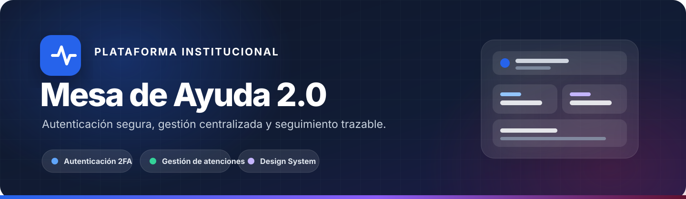
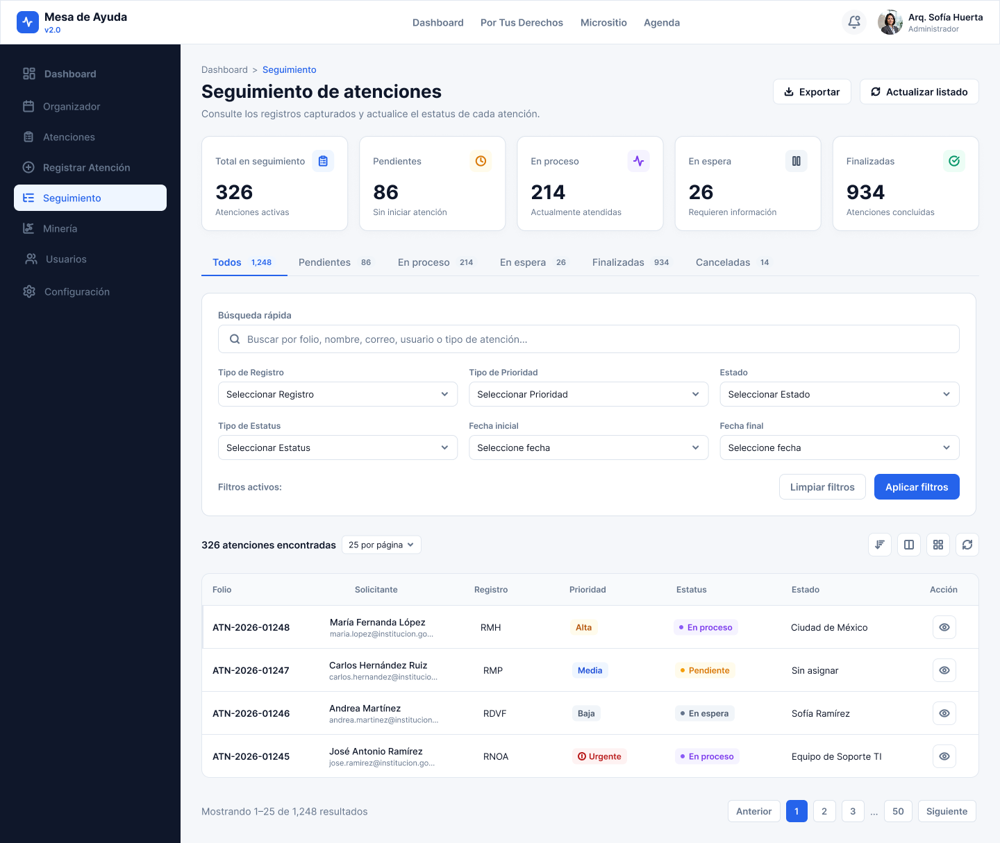
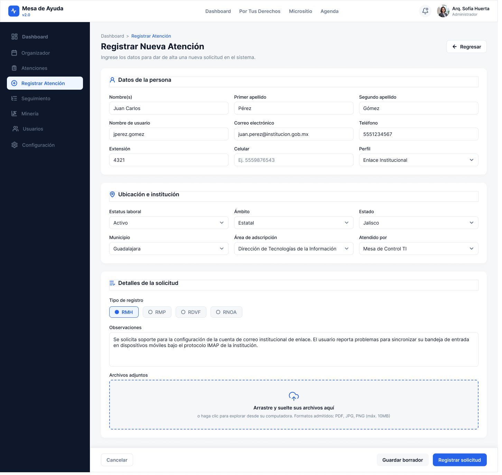
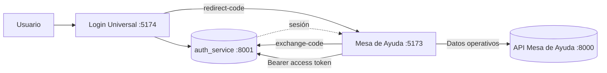

<a id="top"></a>

<div align="center">



  <br />

  <p>
    <strong>Frontend operativo de Mesa de Ayuda del Ecosistema Integral DGCP.</strong>
  </p>

  <p>
    Aplicación web modular para registrar, consultar y dar seguimiento a las atenciones,
    integrada con el Login Universal y los servicios institucionales del Ecosistema.
  </p>

  <p>
    
    
    
    
    
  </p>

</div>

---

## ✨ Descripción

**Mesa de Ayuda 2.0** es el frontend operativo de Mesa de Ayuda dentro del
**Ecosistema Integral DGCP**.

Este repositorio contiene exclusivamente la aplicación de Mesa de Ayuda.
El Login Universal, `auth_service` y la API operativa son proyectos y servicios
independientes.

La aplicación mantiene una arquitectura modular basada en componentes reutilizables,
tipado estricto, separación por dominio y controles automatizados de calidad.

> [!IMPORTANT]
> El frontend se encuentra saneado y validado. La habilitación integral para producción
> depende de completar la alineación del contrato de sesión con `auth_service` y ejecutar
> posteriormente el E2E real de autenticación, refresh y logout.

---

## 🧩 Alcance del repositorio

Este repositorio contiene únicamente:

```text
mesa_de_ayuda/
├── .github/
├── docs/
├── scripts/
├── src/
├── tests/
├── .env.example
├── eslint.config.js
├── package.json
├── playwright.config.ts
├── vite.config.ts
└── vitest.config.ts
```

No contiene el frontend de Login Universal ni los demás módulos del Ecosistema.

### Servicios relacionados

| Servicio            | Puerto local | Responsabilidad                                   |
| ------------------- | -----------: | ------------------------------------------------- |
| Mesa de Ayuda       |       `5173` | Frontend operativo                                |
| Login Universal     |       `5174` | Autenticación y accesos                           |
| `auth_service`      |       `8001` | Autenticación, sesión, `/users/me` y autorización |
| API Mesa de Ayuda   |       `8000` | Dominio operativo de Mesa de Ayuda                |
| Formato NNA público |       `5176` | Interfaz pública independiente                    |

---

## 🖼️ Vista previa

<table>
  <tr>
    <td align="center"><strong>Seguimiento de atenciones</strong></td>
    <td align="center"><strong>Registro de una nueva atención</strong></td>
  </tr>
  <tr>
    <td width="50%">
      
    </td>
    <td width="50%">
      
    </td>
  </tr>
</table>

> Los nombres y datos visibles en las capturas son demostrativos.

---

## 🚀 Capacidades principales

### Dashboard

- Resumen operativo de Mesa de Ayuda.
- Métricas y visualizaciones.
- Consultas mediante TanStack Query.
- Integración con la API operativa.

### Atenciones

- Registro de nuevas atenciones.
- Validación estructurada de formularios.
- Adjuntos y reglas de archivos.
- Catálogos y campos institucionales.
- Mensajes de éxito y error.

### Seguimiento

- Consulta de atenciones.
- Filtros.
- Paginación.
- Vista de detalle.
- Historial y archivos relacionados.

### Organizador

- Vista operativa para organización y seguimiento de actividades.

### Perfil

- Consulta de información del usuario autenticado.
- Datos administrativos de sólo lectura.
- Estado de seguridad de la cuenta.

### Autenticación integrada

- Entrada mediante `redirect-code`.
- Intercambio mediante `exchange-code`.
- Access token mantenido únicamente en memoria.
- Guards de sesión.
- Cierre automático por inactividad.
- Sincronización de logout entre pestañas.
- Redirección al Login Universal cuando la sesión termina.

---

## 🧰 Tecnologías

| Área          | Tecnologías                              |
| ------------- | ---------------------------------------- |
| Frontend      | React 19, React DOM, TypeScript 6        |
| Build         | Vite 8                                   |
| Navegación    | React Router                             |
| Datos remotos | TanStack Query                           |
| Formularios   | React Hook Form, Zod                     |
| Estado        | Zustand                                  |
| UI            | Radix UI, Lucide React, Font Awesome     |
| Estilos       | Tailwind CSS 4, Design Tokens, CSS       |
| Interacción   | Motion, Sonner                           |
| Pruebas       | Vitest, Testing Library, Playwright      |
| Calidad       | ESLint, Prettier, React Doctor           |
| Encoding      | UTF-8 sin BOM con validador automatizado |

---

## 🏗️ Arquitectura



### Responsabilidades

```text
Login Universal
    │
    ├── autenticación
    ├── MFA
    ├── accesos disponibles
    └── redirect-code
          │
          ▼
Mesa de Ayuda
    │
    ├── exchange-code
    ├── sesión frontend
    ├── dashboard
    ├── atenciones
    ├── seguimiento
    ├── organizador
    └── perfil
```

---

## 🔐 Modelo de sesión del frontend

Mesa de Ayuda mantiene el `access_token` exclusivamente en memoria JavaScript.

```text
redirect-code
      ↓
exchange-code
      ↓
access_token
      ↓
memoria JavaScript
      ↓
GET /users/me
      ↓
sesión autenticada
```

`localStorage` y `sessionStorage` sólo se utilizan para un marcador no sensible
que indica la preferencia de persistencia de sesión.

No se deben almacenar allí:

- access tokens;
- refresh tokens;
- códigos MFA;
- contraseñas;
- secretos TOTP.

### Refresh token

El frontend está preparado para consumir un refresh token administrado mediante
cookie `HttpOnly` y realiza solicitudes de sesión con credenciales HTTP.

Actualmente existe una diferencia entre este modelo y el contrato vigente de
`auth_service`, que todavía utiliza el refresh token mediante JSON.

Por este motivo, la renovación/restauración real de sesión se considera
**pendiente de alineación con Backend**.

El frontend no será degradado almacenando el refresh token en Web Storage para
resolver temporalmente esta diferencia.

---

## ⚙️ Configuración local

La referencia de variables es `.env.example`.

Configuración principal:

```env
# auth_service
VITE_API_URL=http://127.0.0.1:8001

# API operativa de Mesa de Ayuda
VITE_MESA_AYUDA_API_URL=/mesa-api
VITE_MESA_AYUDA_API_PROXY_TARGET=http://127.0.0.1:8000

# Login Universal
VITE_AUTH_APP_URL=http://127.0.0.1:5174/login

# Formato NNA público
VITE_FORMATO_NNA_PUBLIC_URL=http://127.0.0.1:5176
```

> [!CAUTION]
> Nunca versionar `.env` reales, contraseñas, JWT, cookies, secretos TOTP,
> claves privadas ni otras credenciales.

Durante desarrollo local se utiliza `127.0.0.1` de manera consistente para
evitar inconsistencias de origen y cookies.

---

## ⚡ Inicio rápido

### Requisitos

- Node.js compatible con las dependencias declaradas en el proyecto.
- npm.
- Servicios backend únicamente cuando se prueben integraciones reales.

### Instalación

```powershell
git clone https://github.com/Javiergr99/Mesa_de_Ayuda_2.0.git
cd Mesa_de_Ayuda_2.0
npm install
```

### Desarrollo

```powershell
npm run dev
```

La aplicación estará disponible en:

```text
http://127.0.0.1:5173
```

### Build de producción

```powershell
npm run build
```

---

## 🗂️ Organización del código

```text
src/
├── app/
│   ├── providers/
│   ├── router/
│   └── styles/
│
├── components/
│   ├── layout/
│   └── ui/
│
├── features/
│   ├── attention-create/
│   ├── attentions/
│   ├── auth/
│   ├── dashboard/
│   ├── organizer/
│   ├── placeholders/
│   ├── profile/
│   └── tracking/
│
├── shared/
│   ├── api/
│   ├── catalogs/
│   ├── config/
│   ├── files/
│   ├── lib/
│   ├── navigation/
│   └── permissions/
│
└── main.tsx
```

La organización favorece:

- separación por dominio;
- componentes reutilizables;
- dependencias explícitas;
- contratos tipados;
- testabilidad;
- escalabilidad.

---

## ✅ Calidad y auditoría

Estado validado durante el saneamiento del frontend:

| Validación                   |                           Resultado |
| ---------------------------- | ----------------------------------: |
| UTF-8 válido                 |                                  ✅ |
| BOM                          |                                 `0` |
| Mojibake conocido            |                                 `0` |
| Prettier                     |                                  ✅ |
| Estructura                   | `110` archivos TypeScript validados |
| Imports locales sin resolver |                                 `0` |
| TypeScript                   |                                  ✅ |
| ESLint                       |         ✅ `0 errores / 0 warnings` |
| Unit tests                   |                          ✅ `29/29` |
| Build Vite                   |                                  ✅ |
| React Doctor                 |                        ✅ `100/100` |

### Quality gate

El proyecto dispone de un control integral:

```powershell
npm run quality
```

que ejecuta:

```text
validate:encoding
        ↓
format:check
        ↓
validate:structure
        ↓
typecheck
        ↓
lint
        ↓
test
        ↓
build
        ↓
React Doctor
```

### Encoding

También puede ejecutarse de forma independiente:

```powershell
npm run validate:encoding
```

Este control detecta:

- UTF-8 inválido;
- BOM;
- mojibake;
- caracteres Unicode de reemplazo.

---

## 🧪 Comandos de desarrollo

```powershell
npm run dev
npm run build
npm run typecheck
npm run lint
npm run format
npm run format:check
npm run test
npm run test:e2e
npm run validate:encoding
npm run validate:structure
npm run doctor
npm run quality
```

---

## 🛡️ Seguridad

El frontend aplica las siguientes reglas:

- Access token únicamente en memoria.
- Bearer Token para APIs protegidas.
- Sin JWT persistidos en Web Storage.
- Sin credenciales en parámetros de URL.
- `redirect-code` de un solo uso para entrada desde Login Universal.
- Limpieza de parámetros de intercambio después de procesarlos.
- Logout sincronizado mediante `BroadcastChannel`.
- Cierre de sesión por inactividad.
- Limpieza local incluso cuando el logout remoto no puede completarse.
- Backend como autoridad final de autenticación y autorización.

### Dependencia pendiente de Backend

Para completar el modelo de sesión previsto se requiere que `auth_service`
administre el refresh token mediante cookie `HttpOnly`.

Hasta que el contrato Backend sea actualizado:

- no se considera validada la restauración real tras F5;
- no se considera validado el refresh real mediante cookie;
- no se considera completado el E2E real Auth → Mesa → F5 → logout.

---

## 🧭 Estado del proyecto

### Frontend completado

- [x] Arquitectura modular.
- [x] Dashboard.
- [x] Atenciones.
- [x] Registro de atenciones.
- [x] Seguimiento.
- [x] Organizador.
- [x] Perfil.
- [x] Integración `redirect-code` / `exchange-code`.
- [x] Access token exclusivamente en memoria.
- [x] Cierre por inactividad.
- [x] Sincronización de logout.
- [x] Code splitting por rutas.
- [x] UTF-8 sin BOM ni mojibake.
- [x] Prettier.
- [x] TypeScript.
- [x] ESLint.
- [x] Unit tests.
- [x] Build de producción.
- [x] React Doctor 100/100.
- [x] Quality gate automatizado.

### Integración pendiente

- [ ] Alineación de refresh token `HttpOnly` en `auth_service`.
- [ ] Validación E2E real Auth → Mesa → F5 → logout.
- [ ] Validación final del ambiente de producción.

### Evolutivo

- [ ] Auditoría Lighthouse y Web Vitals.
- [ ] Auditoría dedicada de accesibilidad.
- [ ] Pruebas de integración contra servicios productivos/no simulados cuando corresponda.
- [ ] Observabilidad y estrategia de despliegue por ambientes.

---

## 🎨 Diseño

Referencia principal de diseño:

**Mesa de Ayuda 2.0**

```text
QajWuVBDoFpZ4bSQqI4ZML
```

---

## 👨‍💻 Autor

<div align="center">

<strong>Javier Garcia</strong><br />
Programador Jr · Diseño y desarrollo frontend

  <br />
  <br />

<a href="#top"><strong>Volver al inicio ↑</strong></a>

</div>
