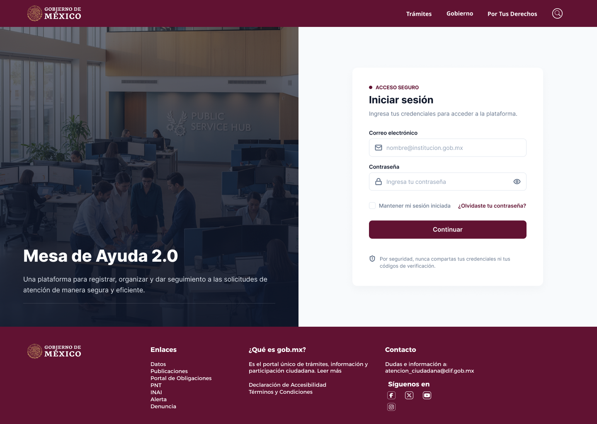
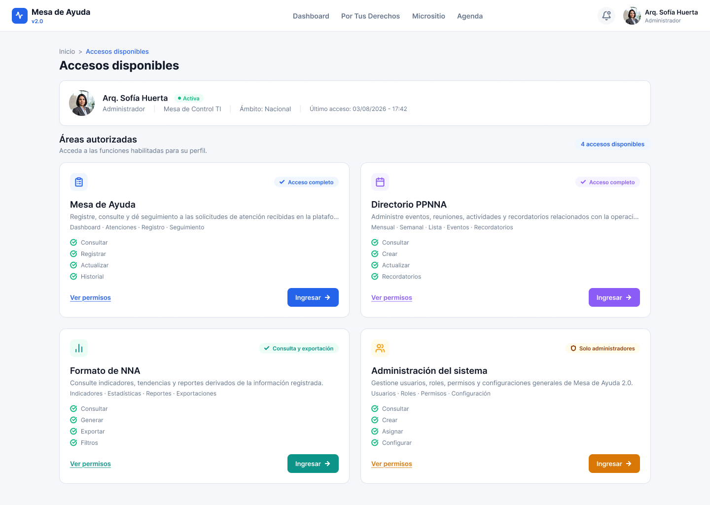
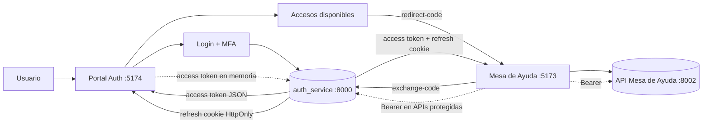

<a id="top"></a>

<div align="center">
  

  <br />

  <p>
    <strong>Plataforma web modular para autenticación centralizada, gestión de accesos y operación de Mesa de Ayuda.</strong>
  </p>

  <p>
    Dos frontends independientes, una sesión segura compartida mediante auth_service y una aplicación operativa desacoplada de la autenticación.
  </p>

  <p>
    <a href="./mesa-ayuda-auth-2.0"><strong>Portal de autenticación</strong></a>
    ·
    <a href="./mesa-ayuda-2.0-figma"><strong>Aplicación operativa</strong></a>
    ·
    <a href="#-inicio-rápido"><strong>Inicio rápido</strong></a>
    ·
    <a href="#-arquitectura"><strong>Arquitectura</strong></a>
    ·
    <a href="#-calidad-y-pruebas"><strong>Calidad</strong></a>
  </p>

  <p>
    
    
    
    
    
  </p>
</div>

---

## ✨ Descripción

**Mesa de Ayuda 2.0** moderniza el registro, la organización, el seguimiento y la administración de accesos mediante una arquitectura frontend separada por responsabilidades.

| Aplicación | Carpeta | Puerto local | Responsabilidad |
|---|---|---:|---|
| **Portal de autenticación** | [`mesa-ayuda-auth-2.0`](./mesa-ayuda-auth-2.0) | `5174` | Login, recuperación, creación inicial de contraseña, MFA, sesión, perfil y accesos disponibles. |
| **Aplicación operativa** | [`mesa-ayuda-2.0-figma`](./mesa-ayuda-2.0-figma) | `5173` | Dashboard, organizador, atenciones, seguimiento, perfil, administración de usuarios y configuración visual. |

La autenticación y la operación se despliegan y prueban de manera independiente. `auth_service` conserva la autoridad de autenticación y autorización; la API de Mesa de Ayuda atiende el dominio operativo.

> [!IMPORTANT]
> La sesión vigente **no almacena JWT en Web Storage**. El access token vive únicamente en memoria JavaScript y el refresh token permanece en una cookie `HttpOnly` administrada por `auth_service`. `sessionStorage/localStorage` solo conservan un marcador no sensible de preferencia de persistencia.

---

## 🖼️ Vista previa

<table>
  <tr>
    <td align="center"><strong>Inicio de sesión institucional</strong></td>
    <td align="center"><strong>Accesos disponibles</strong></td>
  </tr>
  <tr>
    <td width="50%">
      
    </td>
    <td width="50%">
      
    </td>
  </tr>
  <tr>
    <td align="center"><strong>Seguimiento de atenciones</strong></td>
    <td align="center"><strong>Registro de una nueva atención</strong></td>
  </tr>
  <tr>
    <td width="50%">
      
    </td>
    <td width="50%">
      
    </td>
  </tr>
</table>

> Los nombres y datos visibles en las capturas son demostrativos.

---

## 🚀 Capacidades principales

### Portal de autenticación

- Login mediante CURP y contraseña.
- Creación inicial y recuperación de contraseña.
- Configuración y verificación MFA/TOTP.
- `temp_token`, `qr_uri` y `manual_key` únicamente en memoria.
- Access token únicamente en memoria.
- Refresh token mediante cookie `HttpOnly`.
- Renovación de sesión y restauración después de recargar la página.
- Cierre automático por 60 minutos de inactividad.
- Sincronización de logout entre pestañas.
- Perfil de consulta.
- Accesos disponibles construidos desde grupos, módulos y acciones.
- Puente SSO mediante `redirect-code` / `exchange-code`.
- Modo mock opcional para desarrollo.

### Aplicación operativa

- Dashboard con integración a la API operativa.
- Organizador.
- Listado y registro de atenciones.
- Adjuntos y validaciones de formulario.
- Seguimiento, filtros, paginación y drawer de detalle.
- Perfil autenticado.
- Administración de usuarios y permisos.
- Configuración local de apariencia e identidad.
- Guards de autorización por acción.
- Integración con Login Universal.
- Code splitting por rutas con `React.lazy`.

---

## 🧰 Tecnologías

| Área | Tecnologías |
|---|---|
| **Frontend** | React 19, React DOM, TypeScript 6 y Vite 8. |
| **Estilos** | Tailwind CSS 4, Design Tokens, variables CSS y CVA. |
| **Navegación** | React Router 8. |
| **Datos remotos** | TanStack Query; Axios en Auth y clientes HTTP tipados en la aplicación operativa. |
| **Formularios** | React Hook Form y Zod. |
| **Estado cliente** | Zustand. |
| **UI** | Radix UI, Lucide React, Font Awesome y `qrcode.react`. |
| **Interacción** | Motion y Sonner. |
| **Pruebas** | Vitest, Testing Library y Playwright. |
| **Calidad** | TypeScript, ESLint, Prettier y React Doctor. |

---

## 🏗️ Arquitectura



### Modelo de sesión

```text
Credenciales
    ↓
temp_token MFA (memoria)
    ↓
TOTP
    ↓
access_token (memoria)
refresh_token (cookie HttpOnly)
    ↓
GET /users/me
    ↓
redirect-code de un solo uso
    ↓
exchange-code en la aplicación destino
```

Los JWT nunca se incorporan a la URL ni se escriben en `localStorage` o `sessionStorage`.

### Organización

```text
Mesa_de_Ayuda_2.0/
├── .github/
│   └── workflows/
│       └── react-doctor.yml
├── docs/
├── mesa-ayuda-auth-2.0/
│   ├── docs/
│   ├── public/
│   ├── scripts/
│   ├── src/
│   └── tests/
└── mesa-ayuda-2.0-figma/
    ├── docs/
    ├── scripts/
    ├── src/
    └── tests/
```

Cada frontend organiza su dominio mediante `app`, `components`, `features`, `shared` y `tests`.

---

## 🎨 Sistema de diseño

Ambos frontends utilizan tokens semánticos y componentes reutilizables. El portal Auth separa sus tokens principales en:

```text
src/app/styles/
├── tokens.css
├── themes.css
├── typography.css
└── index.css
```

La aplicación operativa mantiene sus tokens institucionales y el módulo de configuración visual sin mezclar reglas de negocio con valores de presentación.

---

## ⚡ Inicio rápido

### Requisitos

- Node.js `22.22` o superior.
- npm `10.9` o superior.
- Los servicios backend necesarios para flujos reales.

### Instalación

```powershell
git clone https://github.com/Javiergr99/Mesa_de_Ayuda_2.0.git
cd Mesa_de_Ayuda_2.0

cd .\mesa-ayuda-auth-2.0
npm install

cd ..\mesa-ayuda-2.0-figma
npm install
```

Configure cada frontend a partir de su `.env.example`. No mezcle `localhost` y `127.0.0.1` dentro del mismo flujo de autenticación/cookies.

### Ejecución

**Auth:**

```powershell
cd .\mesa-ayuda-auth-2.0
npm run dev
```

**Aplicación operativa:**

```powershell
cd .\mesa-ayuda-2.0-figma
npm run dev
```

| Servicio | Dirección local |
|---|---|
| Auth frontend | `http://127.0.0.1:5174` |
| Mesa de Ayuda frontend | `http://127.0.0.1:5173` |
| `auth_service` | `http://127.0.0.1:8000` |
| API Mesa de Ayuda | `http://127.0.0.1:8002` |

---

## ⚙️ Configuración de entorno

### Auth

Variables principales:

```env
VITE_API_URL=http://127.0.0.1:8000
VITE_ENABLE_MOCKS=false
VITE_MESA_AYUDA_URL=http://127.0.0.1:5173/app/dashboard
VITE_FORMATO_NNA_URL=http://127.0.0.1:5173/app/formato-nna
VITE_ADMIN_URL=http://127.0.0.1:5173/app/usuarios
```

### Aplicación operativa

Variables principales:

```env
VITE_API_URL=http://127.0.0.1:8000
VITE_AUTH_APP_URL=http://127.0.0.1:5174/login
VITE_MESA_AYUDA_API_URL=/mesa-api
VITE_MESA_AYUDA_API_PROXY_TARGET=http://127.0.0.1:8002
```

Los `.env.example` de cada proyecto son la referencia para variables adicionales.

> [!CAUTION]
> Nunca versionar contraseñas, secretos TOTP, JWT, cookies, claves privadas ni archivos `.env` reales.

---

## 🧭 Rutas principales

### Auth

| Ruta | Uso |
|---|---|
| `/login` | Inicio de sesión. |
| `/recuperar-acceso` | Recuperación de acceso. |
| `/restablecer-contrasena?token=...` | Restablecimiento. |
| `/crear-password?token=...` | Creación inicial de contraseña. |
| `/crear-contrasena?token=...` | Alias temporal compatible. |
| `/mfa/configurar` | Configuración inicial de MFA. |
| `/mfa/verificar` | Verificación recurrente. |
| `/acceso-correcto` | Transición posterior a MFA. |
| `/accesos` | Aplicaciones autorizadas. |
| `/perfil` | Perfil de consulta. |
| `/cerrar-sesion` | Puente de logout. |

### Aplicación operativa

| Ruta | Uso |
|---|---|
| `/app/dashboard` | Dashboard. |
| `/app/organizador` | Organizador. |
| `/app/atenciones` | Listado de atenciones. |
| `/app/atenciones/nueva` | Registro de atención. |
| `/app/formato-nna` | Entrada autorizada que reutiliza el formulario. |
| `/app/seguimiento` | Seguimiento. |
| `/app/perfil` | Perfil. |
| `/app/usuarios` | Administración de usuarios. |
| `/app/usuarios/nuevo` | Alta de usuario. |
| `/app/usuarios/:userId/editar` | Edición. |
| `/app/configuracion/apariencia` | Configuración visual. |
| `/app/mineria` | Módulo pendiente. |

---

## ✅ Calidad y pruebas

Baseline validado el **13 de agosto de 2026**:

| Validación | Operativo | Auth |
|---|---:|---:|
| TypeScript | ✅ | ✅ |
| Unit tests | **42/42** | **26/26** |
| Build Vite | ✅ | ✅ |
| React Doctor | **100/100** | **100/100** |
| Chunk principal máximo observado | **469.44 kB** | **340.24 kB** |
| Warning `>500 kB` | eliminado | eliminado |
| E2E real Auth → Mesa → F5 → logout | cubierto por la suite cross-app | **1 passed** |

Comandos habituales:

```powershell
npm run typecheck
npm run lint
npm run test
npm run build
npm run doctor
```

Auth dispone además de:

```powershell
npm run test:e2e:real
```

El E2E real usa una cuenta dedicada de pruebas y secretos suministrados exclusivamente mediante variables de entorno locales.

---

## 🔐 Seguridad

- Bearer continúa siendo el mecanismo de autorización de las APIs protegidas.
- El **access token vive exclusivamente en memoria**.
- El **refresh token vive exclusivamente en cookie `HttpOnly`**.
- La preferencia “mantener sesión” se conserva como un marcador no sensible; no almacena JWT.
- El `temp_token` del desafío MFA vive únicamente en memoria.
- `qr_uri`, `manual_key`, códigos TOTP y contraseñas no se persisten.
- El refresh rota en backend y se utiliza para restaurar una sesión después de F5.
- El logout remoto elimina/revoca la sesión y la aplicación limpia su estado aunque el request de cierre falle.
- `BroadcastChannel` sincroniza cierres entre pestañas.
- Las sesiones autenticadas se cierran tras 60 minutos de inactividad.
- El frontend oculta acciones no autorizadas, pero el backend conserva la autoridad final.

---

## 🗺️ Hoja de ruta

### Completado

- [x] Frontends independientes para Auth y operación.
- [x] Login, recuperación y creación inicial de contraseña.
- [x] MFA/TOTP.
- [x] Refresh mediante cookie HttpOnly.
- [x] SSO `redirect-code` / `exchange-code`.
- [x] Restauración de sesión tras F5.
- [x] Dashboard y API operativa.
- [x] Atenciones y seguimiento.
- [x] Administración de usuarios y permisos.
- [x] Perfil en ambos frontends.
- [x] Configuración visual local.
- [x] Code splitting por rutas.
- [x] React Doctor 100/100 en ambos frontends.
- [x] E2E real de autenticación, SSO, refresh y logout.
- [x] Integración de React Doctor en CI.

### Pendiente / evolutivo

- [ ] Implementar Minería.
- [ ] Persistencia institucional/global de apariencia cuando exista contrato backend.
- [ ] Capacidades administrativas que todavía no publique `auth_service` (auditoría, operaciones especializadas, etc.).
- [ ] Preparar despliegue por ambientes y observabilidad.
- [ ] Auditorías dedicadas de accesibilidad y rendimiento de experiencia real (Lighthouse/Web Vitals).

---

## 🤝 Colaboración

Antes de integrar cambios:

1. Mantenga el cambio dentro del módulo correspondiente.
2. Actualice pruebas cuando cambie comportamiento.
3. No debilite contratos de autenticación o permisos para resolver problemas visuales.
4. Ejecute typecheck, tests, build y React Doctor.
5. Para cambios de autenticación/SSO, ejecute también el E2E real.

---

## 🎯 Diseño

Referencia principal de Figma:

**Mesa de Ayuda 2.0**
`QajWuVBDoFpZ4bSQqI4ZML`

---

## 👨‍💻 Autor

<div align="center">
  <strong>Javier Garcia</strong><br />
  Programador Jr · Diseño y desarrollo frontend
</div>

<div align="center">
  <br />
  <a href="#top"><strong>Volver al inicio ↑</strong></a>
</div>
