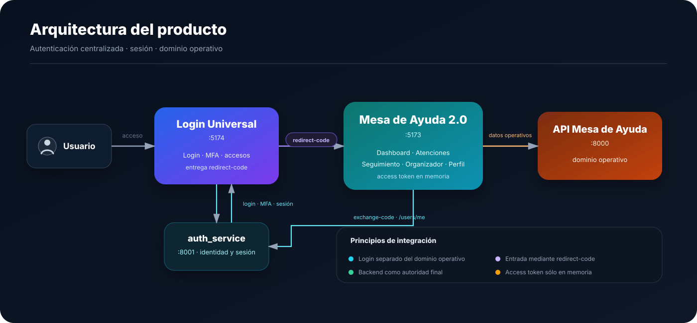
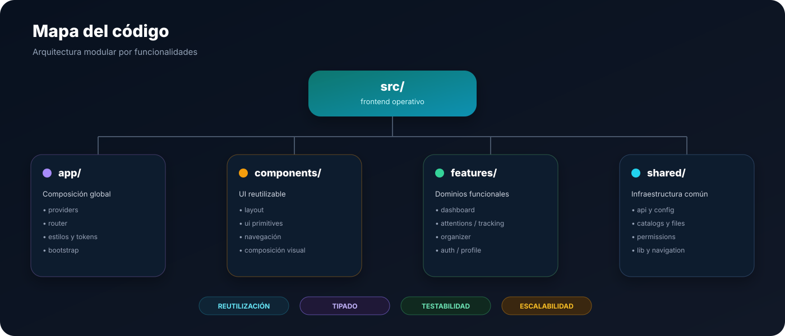

<a id="top"></a>

<div align="center">


<br />

<p>
  <strong>Frontend operativo de Mesa de Ayuda del Ecosistema Integral DGCP.</strong>
</p>

<p>
  Dashboard · Atenciones · Seguimiento · Organizador · Perfil · Integración institucional
</p>

<p>
  
  
  
  
</p>

<p>
  
  
  
</p>

<p>
  <a href="#-vista-previa"><strong>Vista previa</strong></a>
  ·
  <a href="#-arquitectura"><strong>Arquitectura</strong></a>
  ·
  <a href="#-capacidades-del-producto"><strong>Capacidades</strong></a>
  ·
  <a href="#-stack-tecnológico"><strong>Stack</strong></a>
  ·
  <a href="#-arquitectura-del-código"><strong>Código</strong></a>
  ·
  <a href="#-diseño"><strong>Figma</strong></a>
</p>

</div>

---

## ✨ Descripción

**Mesa de Ayuda 2.0** es el frontend operativo de atención y seguimiento dentro del
**Ecosistema Integral DGCP**.

Su función es concentrar los flujos de registro, consulta y seguimiento de atenciones
en una experiencia modular, consistente y preparada para integrarse con los servicios
institucionales del ecosistema.

<table>
<tr>
<td width="33%" align="center" valign="top">

### 📊 Operación

Dashboard, indicadores y contexto general de trabajo.

</td>
<td width="33%" align="center" valign="top">

### 🧾 Atenciones

Registro, consulta y trazabilidad de solicitudes.

</td>
<td width="33%" align="center" valign="top">

### 🧭 Seguimiento

Filtros, detalle, historial y continuidad operativa.

</td>
</tr>
</table>

---

## 🖼️ Vista previa

<table>
  <tr>
    <td align="center"><strong>Seguimiento de atenciones</strong></td>
    <td align="center"><strong>Registro de atención</strong></td>
  </tr>
  <tr>
    <td width="50%">
      
    </td>
    <td width="50%">
      
    </td>
  </tr>
</table>

<p align="center">
  <sub>Los nombres y datos visibles en las capturas son demostrativos.</sub>
</p>

---

## 🏗️ Arquitectura

<p align="center">
  
</p>

<table>
<tr>
<td width="25%" align="center" valign="top">

<strong>01 · ENTRADA</strong>

<br /><br />

El usuario se autentica en Login Universal.

</td>
<td width="25%" align="center" valign="top">

<strong>02 · HANDOFF</strong>

<br /><br />

Mesa recibe un <code>redirect-code</code> de un solo uso.

</td>
<td width="25%" align="center" valign="top">

<strong>03 · SESIÓN</strong>

<br /><br />

Se intercambia el código y el access token vive en memoria.

</td>
<td width="25%" align="center" valign="top">

<strong>04 · OPERACIÓN</strong>

<br /><br />

Mesa consume su API para atender el dominio operativo.

</td>
</tr>
</table>

<p align="center">
  
  
  
  
</p>

---

## 🧩 Capacidades del producto

<table>
<tr>
<td width="33%" valign="top">

<strong>📊 Dashboard</strong>

<br /><br />

Resumen operativo, métricas y visualizaciones para el trabajo diario.

<br /><br />

<code>dashboard</code> · <code>query</code> · <code>metrics</code>

</td>
<td width="33%" valign="top">

<strong>📝 Registro</strong>

<br /><br />

Captura estructurada de nuevas atenciones con validaciones y adjuntos.

<br /><br />

<code>forms</code> · <code>schemas</code> · <code>files</code>

</td>
<td width="33%" valign="top">

<strong>🔎 Seguimiento</strong>

<br /><br />

Consulta, filtros, paginación, detalle e historial de atenciones.

<br /><br />

<code>tracking</code> · <code>filters</code> · <code>history</code>

</td>
</tr>
<tr>
<td width="33%" valign="top">

<strong>🗓️ Organizador</strong>

<br /><br />

Vista de apoyo para organización y continuidad de actividades.

<br /><br />

<code>organizer</code> · <code>workflow</code>

</td>
<td width="33%" valign="top">

<strong>👤 Perfil</strong>

<br /><br />

Información administrativa del usuario y estado de seguridad.

<br /><br />

<code>profile</code> · <code>security</code>

</td>
<td width="33%" valign="top">

<strong>🔐 Autenticación integrada</strong>

<br /><br />

Entrada mediante redirect-code, guards e inactividad.

<br /><br />

<code>auth</code> · <code>session</code> · <code>guards</code>

</td>
</tr>
</table>

---

## 🛠️ Stack tecnológico

<div align="center">

### Core


<br />
<br />


</div>

<br />

<table>
<tr>
<td width="50%" valign="top">

<strong>⚙️ Estado · Datos · Formularios</strong>

<br /><br />


</td>
<td width="50%" valign="top">

<strong>🎛️ UI · Interacción</strong>

<br /><br />


</td>
</tr>
<tr>
<td width="50%" valign="top">

<strong>🧪 Testing · Calidad</strong>

<br /><br />


</td>
<td width="50%" valign="top">

<strong>🎨 Diseño · Tooling</strong>

<br /><br />


</td>
</tr>
</table>

---

## 🗂️ Arquitectura del código

<p align="center">
  
</p>

<details>
<summary><strong>Explorar estructura técnica</strong></summary>

<br />

```text
src/
├── app/
│   ├── providers/
│   ├── router/
│   └── styles/
├── components/
│   ├── layout/
│   └── ui/
├── features/
│   ├── attention-create/
│   ├── attentions/
│   ├── auth/
│   ├── dashboard/
│   ├── organizer/
│   ├── placeholders/
│   ├── profile/
│   └── tracking/
├── shared/
│   ├── api/
│   ├── catalogs/
│   ├── config/
│   ├── files/
│   ├── lib/
│   ├── navigation/
│   └── permissions/
└── main.tsx
```

</details>

<p align="center">
  
  
  
  
</p>

---

## 🎨 Diseño

<div align="center">

<p>
  La interfaz se diseñó como parte del sistema visual del <strong>Ecosistema Integral DGCP</strong>,
  manteniendo consistencia entre layout, navegación, componentes y estados.
</p>

<p>
  <a href="https://www.figma.com/design/QajWuVBDoFpZ4bSQqI4ZML/Mesa-de-Ayuda-2.0?node-id=0-1&t=mOrXzvU57rhdF9P2-1">
    
  </a>
</p>

</div>

---

## 👨‍💻 Autor

<div align="center">

<br />


### Javier Garcia

**Programador Jr · Frontend Developer · UX/UI**

Diseño y desarrollo de interfaces modulares, consistentes y orientadas a producto.

<br />

<a href="https://github.com/Javiergr99">
  
</a>

<br />
<br />


<br />
<br />

<a href="#top"><strong>Volver al inicio ↑</strong></a>

</div>
