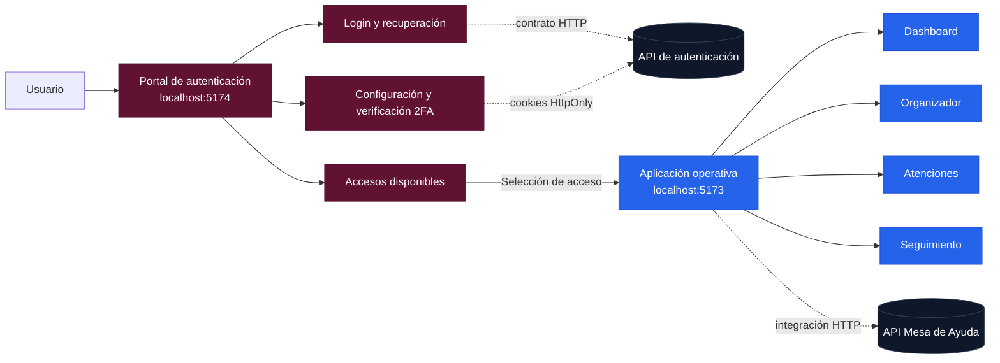

<a id="top"></a>

<div align="center">
  

  <br />

  <p>
    <strong>Plataforma frontend para centralizar el registro, la organización y el seguimiento de solicitudes de atención.</strong>
  </p>

  <p>
    Un ecosistema modular compuesto por un portal independiente de autenticación y una aplicación operativa para la gestión de atenciones.
  </p>

  <p>
    <a href="./mesa-ayuda-auth-2.0"><strong>Portal de autenticación</strong></a>
    ·
    <a href="./mesa-ayuda-2.0-figma"><strong>Aplicación operativa</strong></a>
    ·
    <a href="#-inicio-rápido"><strong>Inicio rápido</strong></a>
    ·
    <a href="#-arquitectura"><strong>Arquitectura</strong></a>
    ·
    <a href="#-hoja-de-ruta"><strong>Hoja de ruta</strong></a>
  </p>

  <p>
    
    
    
    
    
  </p>

  <p>
    
    
    
    
  </p>
</div>

---

## ✨ Descripción

**Mesa de Ayuda 2.0** es una propuesta de modernización para administrar solicitudes de atención mediante una experiencia web clara, modular y trazable.

El repositorio reúne dos aplicaciones frontend independientes:

| Aplicación | Carpeta | Puerto local | Responsabilidad |
|---|---|---:|---|
| **Portal de autenticación** | [`mesa-ayuda-auth-2.0`](./mesa-ayuda-auth-2.0) | `5174` | Login, recuperación de acceso, 2FA, sesión y selección de accesos disponibles. |
| **Aplicación operativa** | [`mesa-ayuda-2.0-figma`](./mesa-ayuda-2.0-figma) | `5173` | Dashboard, organizador, atenciones, registro y seguimiento. |

La separación evita mezclar el ciclo de autenticación con los módulos de operación y permite que ambos frontends evolucionen, se desplieguen y se prueben de manera independiente.

> [!IMPORTANT]
> El proyecto se encuentra en desarrollo. La experiencia visual y los flujos con datos simulados están implementados; la integración definitiva con el backend se realizará conforme al contrato de API acordado.

<p align="right"><a href="#top">Volver arriba ↑</a></p>

---

## 🖼️ Vista previa

<table>
  <tr>
    <td align="center"><strong>Inicio de sesión institucional</strong></td>
    <td align="center"><strong>Accesos disponibles</strong></td>
  </tr>
  <tr>
    <td width="50%">
      
    </td>
    <td width="50%">
      
    </td>
  </tr>
  <tr>
    <td align="center"><strong>Seguimiento de atenciones</strong></td>
    <td align="center"><strong>Registro de una nueva atención</strong></td>
  </tr>
  <tr>
    <td width="50%">
      
    </td>
    <td width="50%">
      
    </td>
  </tr>
</table>

> Los nombres, registros y datos visibles en las capturas son demostrativos y no representan información operativa real.

<p align="right"><a href="#top">Volver arriba ↑</a></p>

---

## 🚀 Capacidades principales

### Portal de autenticación

- Inicio de sesión con una interfaz institucional y responsiva.
- Flujo preparado para autenticación de dos factores.
- Configuración inicial y verificación recurrente mediante código OTP.
- Recuperación de acceso.
- Guards para rutas públicas, pendientes de 2FA y protegidas.
- Pantalla de accesos disponibles según perfil y permisos.
- Cierre y control de sesión desde un proveedor centralizado.
- Header y footer institucionales aplicados únicamente al flujo público de autenticación.
- Tema visual independiente para autenticación y para la zona privada.
- Repositorios simulados intercambiables por servicios HTTP reales.

### Aplicación operativa

- Dashboard administrativo con indicadores y actividad reciente.
- Organizador con vistas mensual, semanal y de lista.
- Consulta de atenciones en tabla y tablero.
- Registro de nuevas atenciones con validación y archivos adjuntos.
- Seguimiento mediante indicadores, filtros, búsqueda y paginación.
- Drawer de detalle con resumen, historial, archivos y actualización.
- Navegación preparada para Minería, Usuarios y Configuración.
- Componentes de interfaz reutilizables y arquitectura basada en funcionalidades.

<p align="right"><a href="#top">Volver arriba ↑</a></p>

---

## 🧰 Tecnologías

<div align="center">
  
</div>

<br />

| Área | Tecnologías |
|---|---|
| **Base frontend** | React 19, React DOM, TypeScript 6 y Vite 8. |
| **Estilos** | Tailwind CSS 4, Design Tokens, variables CSS y `class-variance-authority`. |
| **Navegación** | React Router 8 con rutas anidadas y guards. |
| **Datos remotos** | TanStack Query y repositorios HTTP/mock intercambiables. |
| **Formularios** | React Hook Form, Zod y resolvers tipados. |
| **Estado global** | Zustand para estado ligero del cliente. |
| **Componentes** | Radix UI, Lucide React y Font Awesome Brands. |
| **Interacción** | Motion y Sonner. |
| **Fechas** | date-fns y React Day Picker en la aplicación operativa. |
| **Pruebas** | Vitest, Testing Library y Playwright. |
| **Calidad** | ESLint, Prettier, TypeScript y React Doctor. |

<p align="center">
  
  
  
  
  
  
  
</p>

<p align="right"><a href="#top">Volver arriba ↑</a></p>

---

## 🏗️ Arquitectura



### Organización del repositorio

```text
Mesa_de_Ayuda_2.0/
├── README.md
├── docs/
│   └── assets/
│       ├── mesa-ayuda-banner.svg
│       ├── login.png
│       ├── accesos-disponibles.png
│       ├── seguimiento.png
│       └── registrar-atencion.png
│
├── mesa-ayuda-auth-2.0/
│   ├── public/
│   ├── docs/
│   ├── scripts/
│   ├── src/
│   │   ├── app/
│   │   ├── components/
│   │   ├── features/
│   │   │   ├── auth/
│   │   │   └── access/
│   │   └── shared/
│   └── tests/
│
└── mesa-ayuda-2.0-figma/
    ├── docs/
    ├── scripts/
    ├── src/
    │   ├── app/
    │   ├── components/
    │   ├── features/
    │   │   ├── dashboard/
    │   │   ├── organizer/
    │   │   ├── attentions/
    │   │   ├── attention-create/
    │   │   ├── tracking/
    │   │   └── placeholders/
    │   └── shared/
    └── tests/
```

### Principios aplicados

- **Separación de responsabilidades:** autenticación y operación viven en aplicaciones diferentes.
- **Arquitectura por funcionalidad:** cada módulo agrupa páginas, componentes, modelos y servicios relacionados.
- **Tipado estricto:** contratos, formularios y estados se modelan con TypeScript.
- **Dependencias hacia abstracciones:** los repositorios mock y HTTP implementan responsabilidades equivalentes.
- **Componentes reutilizables:** los elementos visuales compartidos se concentran en `components/ui`.
- **Diseño semántico:** los componentes consumen tokens como `--color-primary` en lugar de colores directos.

<p align="right"><a href="#top">Volver arriba ↑</a></p>

---

## 🎨 Sistema de diseño

El portal de autenticación incluye un sistema centralizado de **Design Tokens** para modificar colores, tipografía, radios, sombras, espaciados y estados sin editar cada componente individualmente.

```text
mesa-ayuda-auth-2.0/src/app/styles/
├── tokens.css       # Escalas y valores base
├── themes.css       # Tema de autenticación y tema privado
├── typography.css   # Estilos tipográficos semánticos
└── index.css        # Punto de entrada global
```

Los layouts determinan el tema activo:

```tsx
<div data-theme="auth">...</div>
<div data-theme="mesa-ayuda">...</div>
```

Ejemplo de cambio global:

```css
[data-theme="auth"] {
  --color-primary: #611232;
  --color-primary-hover: #4f0e29;
  --font-weight-page-title: var(--font-weight-bold);
}
```

Al modificar estos valores se actualizan de manera consistente botones, enlaces, estados de foco y títulos que utilizan los tokens semánticos.

<p align="right"><a href="#top">Volver arriba ↑</a></p>

---

## ⚡ Inicio rápido

### Requisitos

- **Node.js `22.22` o superior**.
- **npm `10.9` o superior**.
- Git.

### 1. Clonar el repositorio

```powershell
git clone https://github.com/Javiergr99/Mesa_de_Ayuda_2.0.git
cd Mesa_de_Ayuda_2.0
```

### 2. Instalar el portal de autenticación

```powershell
cd .\mesa-ayuda-auth-2.0
npm install
Copy-Item .env.example .env.local
```

### 3. Instalar la aplicación operativa

```powershell
cd ..\mesa-ayuda-2.0-figma
npm install
Copy-Item .env.example .env.local
```

### 4. Ejecutar ambos frontends

Abre dos terminales.

**Terminal 1 — autenticación:**

```powershell
cd "C:\ruta\Mesa_de_Ayuda_2.0\mesa-ayuda-auth-2.0"
npm run dev
```

**Terminal 2 — aplicación operativa:**

```powershell
cd "C:\ruta\Mesa_de_Ayuda_2.0\mesa-ayuda-2.0-figma"
npm run dev
```

| Servicio | Dirección |
|---|---|
| Portal de autenticación | `http://127.0.0.1:5174` |
| Aplicación operativa | `http://127.0.0.1:5173` |
| Backend esperado | `http://127.0.0.1:8000` |

<details>
  <summary><strong>Credenciales locales de demostración</strong></summary>

  <br />

  Estas credenciales funcionan únicamente cuando el repositorio simulado está habilitado.

  ```text
  Correo: sofia.huerta@institucion.gob.mx
  Contraseña: MesaAyuda2026!
  Código 2FA: 123456
  ```

  No representan cuentas ni secretos de producción.
</details>

<p align="right"><a href="#top">Volver arriba ↑</a></p>

---

## ⚙️ Variables de entorno

### Portal de autenticación

Archivo: `mesa-ayuda-auth-2.0/.env.local`

| Variable | Propósito | Valor local sugerido |
|---|---|---|
| `VITE_API_URL` | URL base de la API de autenticación. | `http://127.0.0.1:8000` |
| `VITE_ENABLE_MOCKS` | Activa los repositorios simulados. | `true` |
| `VITE_MESA_AYUDA_URL` | Destino del acceso principal. | `http://127.0.0.1:5173/app/dashboard` |
| `VITE_ORGANIZADOR_URL` | Destino del organizador. | `http://127.0.0.1:5173/app/organizador` |
| `VITE_MINERIA_URL` | Destino de minería. | `http://127.0.0.1:5173/app/mineria` |
| `VITE_ADMIN_URL` | Destino administrativo. | `http://127.0.0.1:5173/app/usuarios` |
| `VITE_POR_TUS_DERECHOS_URL` | Enlace público utilizado por el header institucional. | Definir según ambiente. |
| `VITE_GOBMX_SEARCH_URL` | Buscador institucional. | `https://www.gob.mx/busqueda` |

### Aplicación operativa

Archivo: `mesa-ayuda-2.0-figma/.env.local`

| Variable | Propósito | Valor local sugerido |
|---|---|---|
| `VITE_API_URL` | URL base de la API operativa. | `http://127.0.0.1:8000` |
| `VITE_USE_MOCKS` | Activa los datos simulados de la aplicación. | `true` |

> [!CAUTION]
> No subas archivos `.env`, tokens, contraseñas, secretos, certificados o credenciales reales al repositorio.

<p align="right"><a href="#top">Volver arriba ↑</a></p>

---

## 🧭 Rutas principales

### Autenticación

| Ruta | Descripción |
|---|---|
| `/login` | Inicio de sesión. |
| `/recuperar-acceso` | Recuperación de cuenta. |
| `/mfa/configurar` | Configuración inicial del segundo factor. |
| `/mfa/verificar` | Verificación del código OTP. |
| `/acceso-correcto` | Confirmación y transición de autenticación. |
| `/accesos` | Selección de módulos y permisos disponibles. |

### Aplicación operativa

| Ruta | Descripción |
|---|---|
| `/app/dashboard` | Resumen operativo. |
| `/app/organizador` | Calendario y actividades. |
| `/app/atenciones` | Consulta de atenciones. |
| `/app/atenciones/nueva` | Registro de una atención. |
| `/app/seguimiento` | Seguimiento, filtros y actualización. |
| `/app/mineria` | Ruta preparada para el módulo de minería. |
| `/app/usuarios` | Ruta preparada para administración de usuarios. |
| `/app/configuracion` | Ruta preparada para configuración. |

<p align="right"><a href="#top">Volver arriba ↑</a></p>

---

## ✅ Calidad y pruebas

Cada aplicación incluye scripts para validar tipos, estilo, pruebas y construcción.

```powershell
npm run typecheck
npm run lint
npm run format:check
npm run test
npm run test:e2e
npm run doctor
npm run build
```

Validación integral:

```powershell
npm run quality
```

Antes de integrar cambios se recomienda ejecutar, como mínimo:

```powershell
npm run typecheck
npm run lint
npm run test
npm run build
```

### Convención de commits sugerida

```text
feat(auth): integrar endpoint de inicio de sesión
fix(access): corregir permisos visibles por perfil
refactor(ui): centralizar estilos en design tokens
test(tracking): agregar pruebas para filtros
chore: actualizar dependencias del frontend
```

<p align="right"><a href="#top">Volver arriba ↑</a></p>

---

## 🔐 Autenticación y seguridad

La arquitectura está preparada para integrarse con un backend que administre la sesión mediante cookies seguras.

Principios definidos para la integración:

- Axios con `withCredentials: true`.
- Cookies de sesión `HttpOnly`, `Secure` y con política `SameSite` definida por ambiente.
- Tokens temporales únicamente durante los pasos de 2FA.
- Códigos de error estables e independientes del texto mostrado al usuario.
- Rutas protegidas y estados intermedios de autenticación.
- Redirecciones entre aplicaciones mediante códigos de un solo uso o destinos permitidos por backend.
- Limpieza del estado local al cerrar o expirar la sesión.

Actualmente, el modo local puede ejecutarse con repositorios simulados. Antes de producción deben desactivarse los mocks y validarse CORS, cookies, CSRF, renovación, cierre de sesión y expiración con la API real.

<p align="right"><a href="#top">Volver arriba ↑</a></p>

---

## 🗺️ Hoja de ruta

### Completado en frontend

- [x] Arquitectura independiente para autenticación y aplicación operativa.
- [x] Login institucional responsivo.
- [x] Pantallas de configuración y verificación 2FA.
- [x] Guards de navegación.
- [x] Pantalla de accesos disponibles.
- [x] Dashboard administrativo.
- [x] Organizador mensual, semanal y en lista.
- [x] Consulta y registro de atenciones.
- [x] Seguimiento con filtros, tabla y drawer.
- [x] Pruebas unitarias y E2E iniciales.
- [x] Design Tokens en el portal de autenticación.

### En integración o desarrollo

- [ ] Conectar el contrato definitivo de autenticación.
- [ ] Reemplazar repositorios simulados por servicios Axios.
- [ ] Integrar sesión real mediante cookies HttpOnly.
- [ ] Conectar roles, permisos y accesos dinámicos.
- [ ] Integrar endpoints de atenciones y seguimiento.
- [ ] Implementar Minería.
- [ ] Implementar Usuarios y Configuración.
- [ ] Añadir automatización CI/CD.
- [ ] Ejecutar auditorías de accesibilidad y rendimiento.
- [ ] Preparar despliegue por ambientes.

<p align="right"><a href="#top">Volver arriba ↑</a></p>

---

## 🤝 Colaboración

1. Crea una rama a partir de `main`.
2. Mantén los cambios dentro del módulo correspondiente.
3. Evita colores y estilos directos cuando exista un token semántico.
4. Agrega o actualiza pruebas cuando cambie el comportamiento.
5. Ejecuta los comandos de calidad antes del commit.
6. Describe con claridad el alcance y las validaciones realizadas.

Ejemplo:

```powershell
git checkout -b feat/auth-backend-integration
git add .
git commit -m "feat(auth): integrar contrato de autenticación"
git push -u origin feat/auth-backend-integration
```

> [!NOTE]
> El proyecto se mantiene como iniciativa en desarrollo. Las reglas de distribución, contribución externa y licencia deberán formalizarse antes de publicar versiones productivas.

<p align="right"><a href="#top">Volver arriba ↑</a></p>

---

## 🎯 Referencia de diseño

La interfaz parte del sistema visual definido para **Mesa de Ayuda 2.0** en Figma:

- Diseño modular y minimalista.
- Jerarquías claras para operación administrativa.
- Navegación consistente mediante header y sidebar.
- Componentes reutilizables.
- Estados visibles de prioridad, estatus y permisos.
- Temas diferenciados entre autenticación institucional y aplicación privada.

**Archivo de Figma:** [Mesa de Ayuda 2.0](https://www.figma.com/design/QajWuVBDoFpZ4bSQqI4ZML/Mesa-de-Ayuda-2.0?node-id=0-1)

<p align="right"><a href="#top">Volver arriba ↑</a></p>

---

## 👨‍💻 Autor

<div align="center">
  <strong>Javier Garcia</strong><br />
  Programador Jr · Diseño y desarrollo frontend<br /><br />
  <a href="https://github.com/Javiergr99">
    
  </a>
</div>

---

<div align="center">
  <sub>
    Construido con React, TypeScript y una arquitectura diseñada para crecer sin perder consistencia.
  </sub>
  <br /><br />
  <a href="#top"><strong>Volver al inicio ↑</strong></a>
</div>
